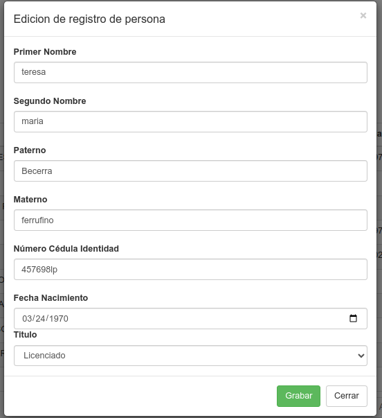

# CRUD-PHP-MySQL-JQuery-AJAX-DATATABLE-BOOTSTRAP USUARIOS, PERSONAS Y LOGIN 

### Operaciones basicas de insersion, lectura, eliminacion, actualizacion con JQuery, DATATABLES, AJAX,  PHP, MySQL, POO y PDO

Descripcion
Este proyecto implementa operaciones CRUD completas (Crear, Leer, Actualizar y Eliminar), junto con filtrado y paginación en un grid. A continuación, se describen las funcionalidades principales:

*Operaciones CRUD y Filtrado: Todas las operaciones de CRUD y filtrado son completamente funcionales.

*Grid con Filtros: El grid permite filtrar datos por todos los campos.

*Ajuste de Columnas: Es posible cambiar el ancho de las columnas en el grid.

*Paginación: El grid incluye paginación y permite seleccionar el número de elementos por página (10, 20, etc.).

* Se implementan 3 CRUD sobre las tablas persona, y usuario.

* Esta implementado el login al sistema 

### :pushpin:  Recursos usados ​​
* PHP
* Bootstrap 
* JQuery

```vue
https://ajax.googleapis.com/ajax/libs/jquery/2.2.0/jquery.min.js
https://maxcdn.bootstrapcdn.com/bootstrap/3.3.6/css/bootstrap.min.css
https://cdn.datatables.net/1.10.12/js/jquery.dataTables.min.js
https://cdn.datatables.net/1.10.12/js/dataTables.bootstrap.min.js	
https://cdn.datatables.net/1.10.12/css/dataTables.bootstrap.min.css
https://maxcdn.bootstrapcdn.com/bootstrap/3.3.6/js/bootstrap.min.js
```

### :pushpin:  versiones
PHP Version 7.4.3-4ubuntu2.22 (phpinfo )

mysql version  8.0.37-0ubuntu0.20.04.3 (select VERSION() ver)

linux version Ubuntu 20.04.6 LTS focal fossa (lsb_release -a)

kernel version 6.2.16-3-pve (uname -r)

### Imagenes


Principal


Acerca de


Persona


Adición de Persona


Modificación Persona



Eliminacion


Busqueda persona


Usuario


Adición Usuario


Modificación Usuario


Eliminación Usuario


Busqueda Usuario


